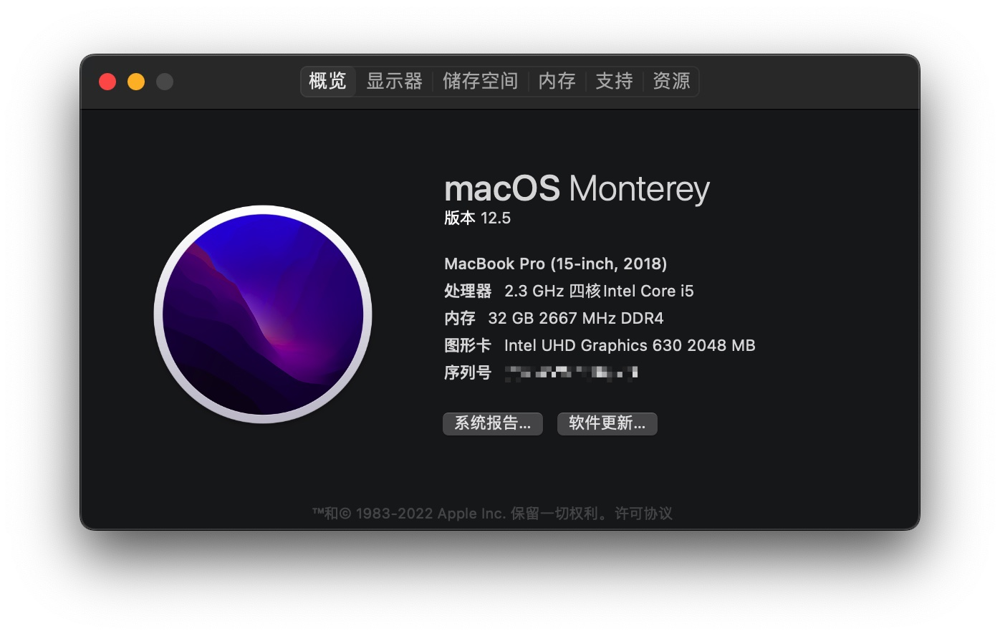

# XPS-15-9570-macOS
XPS-15 9570 Hackintosh

## 💻 Hardware

| Model            | XPS15-9570                   |
| :--------------- | :--------------------------- |
| Processor        | Intel Core i5-8300H          |
| Memory           | Crucial®  32GB (2x16GB) DDR4 |
| Display          | 4K                           |
| Storage          | Samsung SSD PM961 512GB      |
| WiFi / Bluetooth | BCM94360Z4                   |
| OpenCore Version | 0.8.3                        |

## 

此仓库仅限自己使用，其他人用出现问题，本人不负责，网卡也是针对的自己网卡做出的调整

## 🗄 Sources

- https://github.com/xxxzc/xps15-9570-macos

